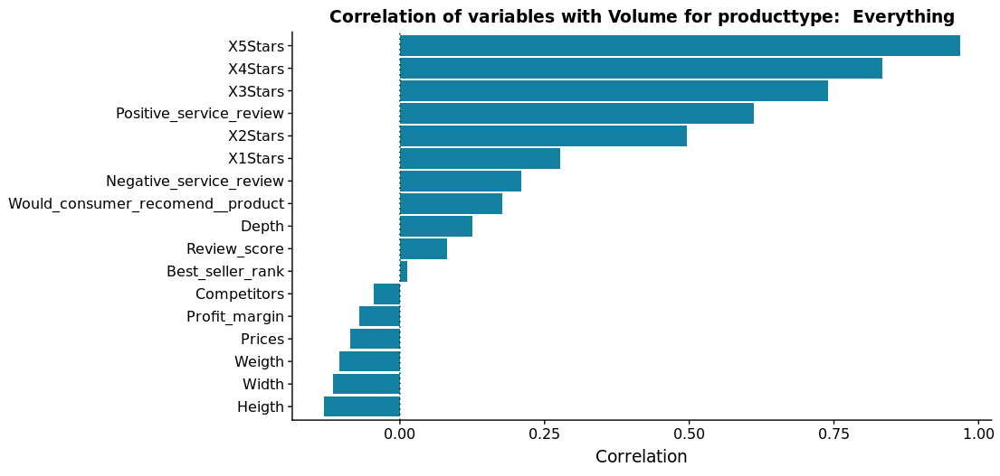
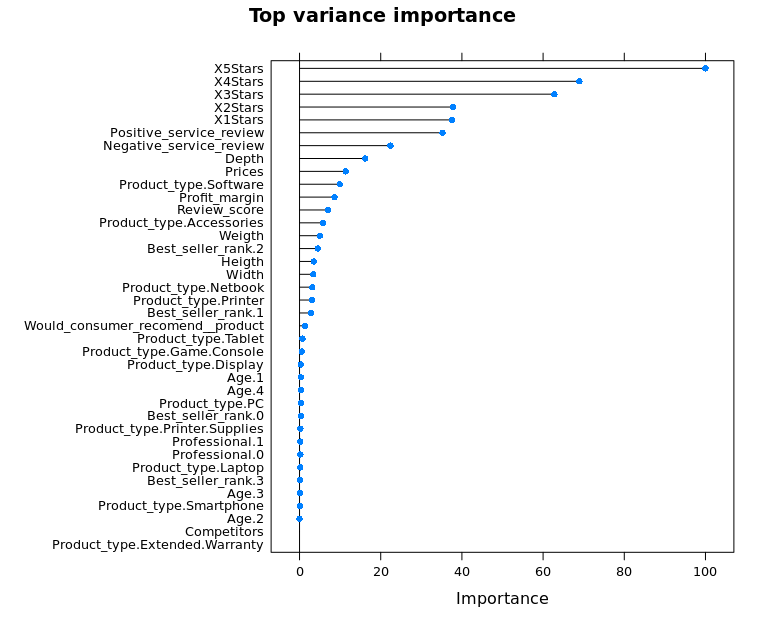

```{r setup, include=FALSE}
knitr::opts_chunk$set(echo = TRUE)
```

## Learning objectives:
This document is intended to showcase my reasoning as well as the accompanying code for the Ubiqum data analytics - week 5 challenge with the 'ChristianProud' dataset. My objectives for our call are as follows:

1. walk-through my logic - is there anything obvious that I'm missing is my thinking and reasoning?
2. assess my code quality
3. identify any other areas for improvement / further learning

In addition, specific questions have been printed **bold** throughout this document.
Many thanks for your help in advance!

Let's kick off with initial setup and loading the data.

```{r Loading libraries & setup clusters, results = "hide", message = FALSE, warning = FALSE}
## Load libraries =================================
library(tidyverse)
library(caret)
library(e1071)
library(magrittr)
library(doParallel)
library(corrplot)
library(cowplot)
# Prepare clusters =================================
# Ignacio: Be carefull with the number of cores you're using in your code. 
# try to leave two cores for the system. First, detect the cores of the system
# and then set up your cluster accordingly:
# Check out: 
# http://rpubs.com/Mentors_Ubiqum/Spike_Computational_cost
cl <- makeCluster(3)
registerDoParallel(cl)
```
```{r Importing and cleaning dataset + introduce Review_score variable, message = FALSE, warning = FALSE}
## Import dataset =================================
existingProducts <- readr::read_csv2('../input/existingChristianProud.csv')
## Preprocessing: cleaning up ==========================
existingProducts %<>% select(-X1)
names(existingProducts) %<>% make.names(.)
## Preprocessing: alter datatypes & calculate new variables ===============
existingProducts %<>%
  mutate(
    Product_type = as.factor(Product_type),
    Depth = as.numeric(Depth),
    Age = as.factor(Age),
    Professional = as.factor(Professional),
    Review_score = (5 * X5Stars + 
                      4 * X4Stars + 
                      3 * X3Stars + 
                      2 * X2Stars + 
                      X1Stars) / 
                      rowSums(select(existingProducts, X5Stars:X1Stars)
                      )
    )
```

Next, I have assessed the data in table form, and concluded that there are products with a volume of 0. There are three possible reasons this can occur:

1. input error
2. newly introduced product which hasn't been sold yet
3. the product is really unpopular

# Ignacio: Very good!!!

In real life, I would explore this issue further with the sales departement. For now, I don't want my model to be disturbed by 0 volume observations, hence I remove them.

In addition, I remove the 'Extended Warranty' observations as they are add-on sales (they are sold coupled to other products) and may therefore have different characteristics as the other products.

```{r, message=F, warning=F, echo=F}
existingProducts %<>% filter(Volume>0)
existingProducts %<>% filter(Product_type != "Extended Warranty")
```

Subsequently, I explore the data further using GGplot. First off, I'm looking at singular data. In particular, I'm looking for the distribution for the dependent variable Volume, as well as for all numeric variables.

```{r, fig.width=5, fig.height=3, warning=F, message=F}
## Data exploration ==========================================
#plotting dependent variable
ggplot(existingProducts, aes(x = Product_type, y = Volume)) +
  geom_boxplot() +
  coord_flip()

# Ignacio: a more fancy plot ;)
#ggplot(existingProducts,aes(x=Product_type,y=Volume)) + 
#  geom_boxplot(aes(fill=Product_type),show.legend = F) +
#  coord_flip() +
#  xlab("Product type") +
#  ggtitle("Sales volume by product type") +
#  theme(axis.title = element_text(family = "Trebuchet MS", color="black", face="bold", size=12),
#        axis.text.x = element_text(family = "Trebuchet MS", color="black", face="bold", size=8),
#        axis.text.y = element_text(family = "Trebuchet MS", color="black", face="bold", size=8),
#        plot.title = element_text(family = "Trebuchet MS", color="black", face="bold", size=20,
#                                  hjust = 0.5))
```

Two outliers are obvious. However, most products seem to have more observations that fall outside of the boxplot. However, it is dangerous to remove these all. For example, for game consoles it might be the case that some products are heavily promoted (e.g. Sony's PS4). Although that is not something that can be explained from the data, it wouldn't be fair to remove these products.

**Question 1: what is an appropriate amount of outliers to remove? If we remove every point outside of the boxplots, we lose >25% of the data.**

# Ignacio: There is no strict answer to this question. It's If you have only a few outliers it ok to 
# remove them. If you have a signitifcant amount of outliers, then you can consider using methods
# insensitive to them. Doy you know which ones?

```{r, fig.width=16, fig.height=12, warning=F, message=F}
#plotting all numeric variables
existingProducts %>%
  keep(is.numeric) %>% 
  gather() %>% 
  ggplot(aes(value)) +
  facet_wrap(~ key, scales = "free") +
  geom_histogram()
# Ignacio: Try out the "GGally" library, and then do: ggally::ggpairs(df)
# It will make this kind of plot for you selecting the rigth type of plot based
# on the type of variable. ;)
```

Outliers are detected in the following variables:

# Ignacio: Very good kind of buisness analysis.
1. Best Sellers ranking -> will be resolved via dummifying
2. Number of reviews -> **Question 2: although I clearly see outliers, these products do really well for a reason. Are these outliers actually a problem in our model or just an exceptional case?**

# Ignacio: First of all, you didn't create a model yet so you can't talk about a problem in your
# model. Second, point 2 is extremelly relevant, alongside with the products which have 0 sales
# as it's also very relevant to know what makes a produt good or bad. 
# Of course, you don't know the current date and the release date, so you can't know if they have
# 0 sales because the had been launched recently or because they are bad. So this is a clear example
# of feature engeeniering which will be of high relevance.
3. Depth -> will be dropped later, as it doesn't have any obvious relation with volume
4. Prices -> high prices (even an outlier) might explain that a products doesn't sell very well. I wouldn't want to lose that information.

```{r, fig.width=5, fig.height=3, warning=F, message=F}
#plotting dependent variable vs most important independent variable (varImp)
ggplot(existingProducts, aes(x = Positive_service_review, y = Volume)) + geom_point()
```

Next, remove the outliers for the Volume variable based on the MAD score.
The function used from outliers.R is as follows:

<i># Detect based on MAD score:

isnt_out_mad <- function(x, thres = 3, na.rm = TRUE) {

  x <- scale(x, center = TRUE, scale = TRUE)

  abs(x - median(x, na.rm = na.rm)) <= thres * mad(x, na.rm = na.rm)
}</i>

```{r, fig.width=16, fig.height=8}
## Outlier detection & removal ===============================
source('../R/outliers.R')
#Detect outliers based on MAD
is_no_outlier <- isnt_out_mad(existingProducts$Volume, thres = 50)
# add a column with info whether the Volume is an outlier
existingProducts$is_no_outlier <- is_no_outlier
# look at the same plot as above, with and without outliers
g_withoutliers <- ggplot(existingProducts, aes(Product_type, Volume)) +
                    geom_boxplot() +
                    coord_flip() +
                    geom_boxplot()
g_withoutoutliers <- ggplot(existingProducts[is_no_outlier == T,], aes(Product_type, Volume)) +
                    geom_boxplot() +
                    coord_flip() +
                    geom_boxplot()
plot_grid(g_withoutliers, g_withoutoutliers, labels = c("With outliers", "Without outliers"))
existingProducts <- existingProducts[is_no_outlier,]
```

This outliers removal technique has gotten rid of the volume outliers. However, internet research tells me that a normal threshold value is 3. Instead, I needed to use 50 here, in order to not lose too much values.

# Ignacio: When you use resources from the web, please cite your sources.

**Question 3: what are better methods for outliers detection in these extreme circumstances? One suggestion is unsupervised clustering (e.g. Isolation forest), but I don't know how to implement this yet. Would that have helped here?**

# Very good question. First of all, have a look to the plots before and after removing the outliers 
# and you will see that you still have outliers after the removal. If you use the function again,
# you will remove more, but other new ones will appear. Therefore, the process of removing outliers 
# can only be done once. 
# On the other hand unsupervised clustering could be an option, but the problem is that unless the
# clustering algorithm takes into account the dependent variable, you don't have any warranty that 
# the resulting groups will be correlated with the sales volumes. 
# In order to use it, try out :
# https://rdrr.io/rforge/IsolationForest/man/AnomalyScore.html


**Question 4: would it help to also remove outliers for dependent variables in this case? I'm hesitant because the total amount of observations is relatively small.**

# Ignacio: I think so, but if you want to be sure try it out and checko out the effect. Remember,
# do it only once. Moreover, the fact of having outliers it may indicate that a particular population
# of data has been undersampled.

The next section plots a correlation matrix after removing the outliers to recheck whether collinearity is now visible.

```{r, fig.width=5, fig.height=3, warning=F, message=F}
## Detect collinearity & correlation =========================
corrData <- cor(existingProducts %>% select(-Age,-Product_type, -Professional, -is_no_outlier) %>% na.omit())
corrplot(corrData, type = "upper", tl.pos = "td",
         method = "circle", tl.cex = 0.5, tl.col = 'black',
         diag = FALSE)
```

Next, recoding the variable Best_Sellers_Rank to the following:

*	If it has a N/A value (product recently introduced, data error, or not available at Amazon) => 0
*	Rank < 50 => 1
*	Rank >= 50 and <100 => 2
*	Rank > 100 => 3

The reasoning behind this is that the regression model might have difficulty picking up on the difference between a rank of, for example, 31 and 38. Both are performing great given the large product universe that Amazon offers. Hence, binning makes sense.

# Ignacio: Very good idea!!!

N/A values might point at at a few things could mean that we have a data/input error. However, it could also mean that a product has just been introduced and not yet been awarded a ranking yet, or is not available on Amazon at all. As the potential damage from including products with a data error is relatively limited, I choose to include all these products instead of omitting them.

# Ignacio: Any aidea of how to perform NA imputation with a method you already know? 

```{r}
## Bin Best_seller_rank, and convert NAs to 0 ================
existingProducts$Best_seller_rank %<>% 
  findInterval(c(-Inf, 50, 100, Inf)) %<>% 
  replace_na(0) %<>% as.factor()
```

Prior to finalising this code, I have ran a training on all variables. The selection of the variables has been based on the varImp of that model, as well as on correlation between the independent and dependent variables. 

**Question 5: the correlation shows that some features should have been included. The best example is Positive_service_reviews. However, my model's performance becomes worse when I include it. What is the best framework for choosing the variables?**

# Ignacio: The problem here, is that varImp uses a RandomForest and this method is based on DT which
# doesn't look for linnear relationships. This can explain why including some variables, destroys
# the performace of the model. 
# Correlation matrixes are specially good to removed redundant features when using LINNEAR models.




The code below takes out the variables that are not selected, effectively leaving my data set with the following features:

* Amount of 1* reviews 
*	Amount of 4* reviews
*	Negative_service_reviews
*	Product_type 
* Best_seller_rank
* Profit_margin

```{r}
## Feature selection =================================
existingSelected <- select(existingProducts,
                           -c(
                             X5Stars,
                             X3Stars,
                             X2Stars,
                             Review_score,
                             Positive_service_review,
                             Product_ID,
                             Depth,
                             Weigth,
                             Width,
                             Heigth,
                             Prices,
                             is_no_outlier,
                               Would_consumer_recomend__product,
                             Age,
                             Professional,
                             Competitors
                             ))
```

The code below dummifies the data, and removes observations with missing data.

```{r}
## Dummify data =================================
newDataFrame <- dummyVars(" ~ .", data = existingSelected)
existingDummy <- data.frame(predict(newDataFrame, newdata = existingSelected))
## Missing data =================================
#after feature selection to retain as much data as possible
existingDummy <- na.omit(existingDummy)
```

Next up is training of the model and predicting on the testdata. Aside from RF, both svmLinear and knn have been tried (with scaling and centering as preprocessing steps). The results from RF were the best with an average R-squared of 50%.

```{r}
## Training of model =================================
for (n in 1) {  #only one run due to time constraints. Model has been run 100 times previously
set.seed(n)
# train and test
train_ids <- createDataPartition(y = existingDummy$Volume,
                                 p = 0.75,
                                 list = F)
train <- existingDummy[train_ids,]
test <- existingDummy[-train_ids,]
# cross validation
ctrl <- trainControl(method = "repeatedcv",
                     number = 4,
                     repeats = 10
                     )
#train Random Forest Regression model
rfFit1 <- caret::train(Volume~. ,
                data = train,
                method = "rf",
                trControl=ctrl,
                #preProcess = c("scale", "center") #only used for distance-modelling techniques (knn, SVM)
                importance=T #added to allow for varImp()
                )
# Predicting testset ================================
test$Predictions <- predict(rfFit1, test)
postResample(test$Predictions, test$Volume)
cat("Test", n, "results in the following metrics:", postResample(test$Predictions, test$Volume),"\n")
} #End of the for loop to test stability of the model with different seed numbers.
```

# Ignacio: What you can try here is to test diferent resamplings and store the error metrics for
# each sample. Then you can plot the results to see up to which extent you have overfitting or not.
# When to print the results of your metrics, dont' forget to write which errror metrics is each one.
# To get different resamples use the keyword: "times" of the "createDataPartition" pf caret, which
# will make your variable "train_ids" to become a matrix, where each column is a different sample.

However, the model is quite unstable as with different seed levels the R-squared varies between 30:70% as can be observed in the table below.

```{r}
y = read.csv('../output/results.csv')
knitr::kable(y, col.names = "Instable results with different seed levels", align = "l")
```

Below, the predictions for volume for the testing set are plotted against the actual values. The performance is quite horrible.

# Ignacio: According to your plot, it seems to me that you have three different regions.
# Moreover, try to plot using different colors for each product accoring to the product 
# type to see if you can find something.

```{r}
ggplot(test, aes(x = Volume, y = Predictions)) + 
        geom_point() + 
        geom_abline(intercept = 0, slope = 1)
```

To make matters worse, the significance of predictions for Product Type laptop is virtually non-existant (see below). The same goes for the other product types we were asked to predict (notebooks, PCs, smartphones). Please note that the number of observations in the testing set is quite limited, which might disturb the picture.
To resolve this, I have tried to add the options 'y = existingDummy$Product_type.Laptop' to the creation of the data partition, but this resulted in most cases in no Laptop observations in the data set.

**Question 6: what can be done to further optimize modelling? Could we for example upsample the laptop observations?**

# Ignacio: The dataset is how it is. May be the laptops are two different among themselves and you
# can't do eneything better.

Lastly, I have tried to create different models for each product type. Based on correlation plots that are specific for the product type, this resulted in a different feature selection. However, performance of these models was lacklustre at best.

Given these metrics, I have refrained from applying my model on the newProducts dataset.

```{r}
ggplot(filter(test, Product_type.Laptop == 1), aes(x = Volume, y = Predictions)) + 
  geom_point() + 
  geom_abline(intercept = 0, slope = 1)
```

The code below has been used for feature selection and has been added for illustrative purposes.

```{r}
#Check important variables
varTun <- varImp(rfFit1)
plot(varTun, main = "Top variance importance")
```

# Ignacio: According to your plot what are the most relevant features and what this tells you.
# Do you think that you can discriminate between product types with the features given?
# In other words, when you buy a product you look for the same features when buying a laptop
# than when buying a printer or an accesory? Are the relevant features present in your dataset?

Lastly, some trivial closing actions need to be performed.

```{r, results = "hide", message = FALSE, warning = FALSE}
# Closing actions ================================
#Save model
#saveRDS(rfFit1, './output/RF.rds')
# Stop Cluster. 
stopCluster(cl)
```
